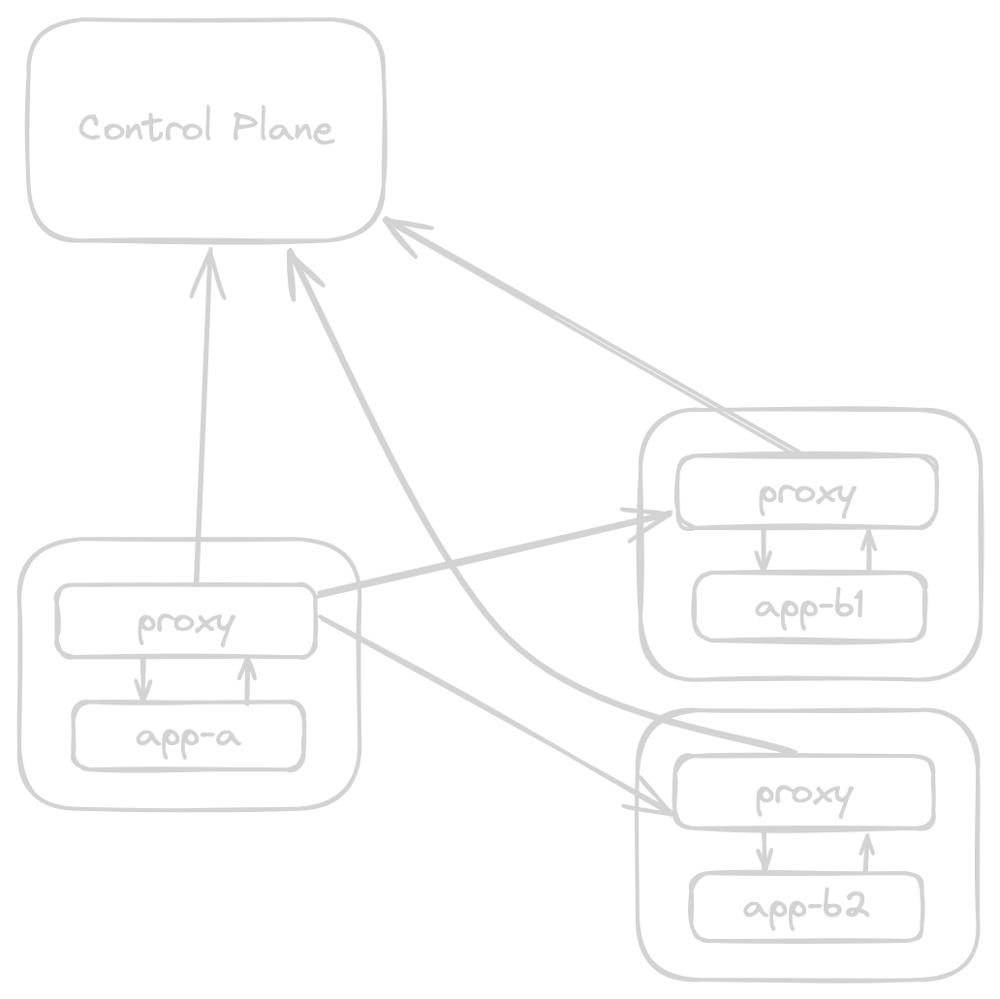

DESCLAIMER: This is a work in progress, the code is not complete and is not working yet.

# DIY Service Mesh

This is a Do-It-Yourself Service Mesh, which is a simple tutorial for understanding 
the internals of a service mesh. The goal of this project is to provide a simple, 
easy-to-understand reference implementation of a service mesh, which can be used 
to learn about the various concepts and technologies used by a service mesh like Linkerd.

## What are you going to learn?

- Build a simple proxy and add service mesh features to it.
- Use Netfilter to intercept and modify network packets.
- Create a simple control plane to manage the service mesh.
- Use gRPC to communicate between the proxy and the control plane.
- How to create a Admision Controller to validate and mutate Kubernetes resources.
- Certificate generation flow and mTLS between the services.
- How HTTP/2 works and how to use it with gRPC to balance the traffic between the services.
- Add useful features like circuit breaking, retries, timeouts, and load balancing.
- Add metrics and tracing to the service mesh with OpenTelemetry.
- Canary deployments.

## Some considerations

- Only for learning propose, not a production-ready service mesh.
- The proxy is going to print many logs to understand what is going on.
- Use IPTables instead Nftables for simplicity.
- Keep the code as simple as possible to make it easy to understand.
- Some Golang errors are ignored for simplicity, in a real-world scenario you should handle them properly.
- Everything is going to be in the same repository to make it easier to understand the project.

## What is going to be built?

The following components are going to be built:

- **proxy-init**: Configure the network namespace of the pod.
- **proxy**: This is the data plane of the service mesh, which is responsible for intercepting and modifying network packets.
- **controller**: This is the control plane of the service mesh, which is responsible to provide the configuration to the data plane.
- **injector**: This is an Admission Controller for Kubernetes, which is responsible for mutating each pod that need to be meshed.
- **samples apps**: Four simple applications that are going to communicate with each other. (http-client, http-server, grpc-client, grpc-server)

## Tools and how to run this project?

- [kind](https://kind.sigs.k8s.io/) to create a Kubernetes cluster locally.
- [Tilt](https://tilt.dev/) to run the project and watch for changes.
- [Buf](https://buf.build/) to lint and generate the Protobuf/gRPC code.
- [Docker](https://www.docker.com/) to build the Docker images.
- [k9s](https://k9scli.io/) to interact with the Kubernetes cluster. (Optional)

To start all the components, run the following command:

```bash
kind create cluster
tilt up
```

Tilt will build all the images and deploy all the components to the Kubernetes cluster.
All the images are created by the `Dockerfile` in the root directory.

The **main branch** contains the WIP version of the project.

## Architecture

The architecture of the service mesh is composed of the following components:



## Creating the http applications

- **http-client**: This application if going to call the `http-server` service.
- **http-server**: This application is going to be called by the `http-client` service.

In the next steps, `grpc-client` and `grpc-server` are going to be created.

http-client:
```go
func main() {
	ctx, cancel := signal.NotifyContext(context.Background(), syscall.SIGINT, syscall.SIGTERM)
	defer cancel()
	n := 0

	endpoint := os.Getenv("ENDPOINT")
	if endpoint == "" {
		endpoint = "http://http-server.http-server.svc.cluster.local./hello"
	}

	httpClient := &http.Client{
		Timeout: 5 * time.Second,
	}

	// This application will call the endpoint every second
	ticker := time.NewTicker(time.Second)
	for {
		select {
		case <-ctx.Done():
			return
		case <-ticker.C:
			req, err := http.NewRequestWithContext(ctx, http.MethodGet, endpoint, nil)
			if err != nil {
				panic(err)
			}

			resp, err := httpClient.Do(req)
			if err != nil {
				panic(err)
			}

			dump, err := httputil.DumpResponse(resp, true)
			if err != nil {
				panic(err)
			}
			resp.Body.Close()

			n++
			fmt.Printf("Response #%d\n", n)
			fmt.Println(string(dump))
		}
	}
}
```

http-server:

```go
func main() {
	ctx, cancel := signal.NotifyContext(context.Background(), syscall.SIGINT, syscall.SIGTERM)
	defer cancel()

	failRate, _ := strconv.Atoi(os.Getenv("FAIL_RATE"))

	n := uint64(0)
	hostname := os.Getenv("HOSTNAME")
	version := os.Getenv("VERSION")

	var b bytes.Buffer
	b.WriteString("Hello from the http-server service! Hostname: ")
	b.WriteString(hostname)
	b.WriteString(" Version: ")
	b.WriteString(version)

	mux := http.NewServeMux()
	mux.HandleFunc("/hello", func(w http.ResponseWriter, r *http.Request) {
		// Dump the request
		dump, _ := httputil.DumpRequest(r, true)
		fmt.Printf("Request #%d\n", atomic.AddUint64(&n, 1))
		fmt.Println(string(dump))
		fmt.Println("---")

		// Simulate failure
		if failRate > 0 {
			// Get a random number between 0 and 100
			n := rand.Intn(100)
			if n < failRate {
				http.Error(w, "Internal server error", http.StatusInternalServerError)
				fmt.Println("Failed to process request")
				return
			}
		}

		w.Header().Set("Content-Type", "text/plain")
		w.WriteHeader(http.StatusOK)
		w.Write(b.Bytes())
	})

	server := &http.Server{
		Addr:    ":8080",
		Handler: mux,
	}

	g, ctx := errgroup.WithContext(ctx)
	g.Go(func() error {
		<-ctx.Done()
		return server.Shutdown(context.Background())
	})

	g.Go(func() error {
		return server.ListenAndServe()
	})

	if err := g.Wait(); err != nil {
		if err != http.ErrServerClosed {
			panic(err)
		}
	}
}
```

The `http-server` service is going to respond with a message that contains the 
hostname and the version of the service. 
Failures will be simulated by setting the FAIL_RATE environment variable.

Each service is going to be deployed in a different namespace:

- http-client: `http-client` Deployment in the `http-client` namespace: [http-client.yaml](./k8s/http-client.yaml)
- http-server: `http-server` Deployment in the `http-server` namespace: [http-server.yaml](./k8s/http-server.yaml)

## Testing the service mesh

Logs for `http-client` and `http-server` pods to see the communication between the services.

http-client logs:
```bash
Response #311
HTTP/1.1 200 OK
Content-Length: 71
Content-Type: text/plain
Date: Sat, 08 Jun 2024 19:38:27 GMT

Hello from http-server service! Hostname: http-server-799c77dc9b-56lmd Version: 1.0
```

http-server logs:
```bash
Request #171
GET /hello HTTP/1.1
Host: http-server.http-server.svc.cluster.local.
Accept-Encoding: gzip
User-Agent: Go-http-client/1.1
```

## Implementing the proxy that will intercept the HTTP/1.1 requests and responses.

### Why need a proxy?

The proxy is going to intercept all of the inbound and outbound traffic of the services. (except explicitly ignored)
Linkerd has a Rust based proxy called `linkerd2-proxy` and Istio has a C++ based proxy called `Envoy`, 
which is a very powerful proxy with a lot of features.

Our proxy is going to be very simple and will be similar to `linkerd2-proxy`.

For now, the proxy is going to listen on two ports, one for the inbound traffic and another for the outbound traffic.

- 4000 for the inbound traffic.
- 5000 for the outbound traffic.

This is a basic implementation of the proxy, intercepting http requests and responses.

```go
func main() {
	ctx, cancel := signal.NotifyContext(context.Background(), os.Interrupt)
	defer cancel()

	g, ctx := errgroup.WithContext(ctx)
	// Inbound connection
	g.Go(func() error {
		return listen(ctx, ":4000", handleInboundConnection)
	})

	// Outbound connection
	g.Go(func() error {
		return listen(ctx, ":5000", handleOutboundConnection)
	})

	if err := g.Wait(); err != nil {
		panic(err)
	}
}

func listen(ctx context.Context, addr string, accept func(net.Conn)) error {
	l, err := net.Listen("tcp", addr)
	if err != nil {
		return fmt.Errorf("failed to listen: %w", err)
	}
	defer l.Close()
	go func() {
		<-ctx.Done()
		l.Close()
	}()

	for {
		conn, err := l.Accept()
		if err != nil {
			return fmt.Errorf("failed to accept: %w", err)
		}

		go accept(conn)
	}
}
```

The `listen` function is going to listen on the port and call the `accept` function when a connection is established.


### handleInboundConnection

All the inbound traffic is going to be intercepted by the proxy, print the request, forward the request
to the local destination port and print the response.

```go
func handleInboundConnection(c net.Conn) {
	defer c.Close()

	// Get the original destination
	_, port, err := getOriginalDestination(c)
	if err != nil {
		fmt.Printf("Failed to get original destination: %v\n", err)
		return
	}

	fmt.Printf("Inbound connection from %s to port: %d\n", c.RemoteAddr(), port)

	// Read the request
	req, err := http.ReadRequest(bufio.NewReader(c))
	if err != nil {
		fmt.Printf("Failed to read request: %v\n", err)
		return
	}

	// Call the local service port
	upstream, err := net.Dial("tcp", fmt.Sprintf("127.0.0.1:%d", port))
	if err != nil {
		fmt.Printf("Failed to dial: %v\n", err)
		return
	}
	defer upstream.Close()

	// Write the request
	if err := req.Write(io.MultiWriter(upstream, os.Stdout)); err != nil {
		fmt.Printf("Failed to write request: %v\n", err)
		return
	}

	// Read the response
	resp, err := http.ReadResponse(bufio.NewReader(upstream), req)
	if err != nil {
		fmt.Printf("Failed to read response: %v\n", err)
		return
	}
	defer resp.Body.Close()

	// Write the response
	if err := resp.Write(io.MultiWriter(c, os.Stdout)); err != nil {
		fmt.Printf("Failed to write response: %v\n", err)
		return
	}

	// Add a newline for better readability
	fmt.Println()
}
```

The `handleInboundConnection` function first read the destination port to our service,
iptables is going to set the destination port in the `SO_ORIGINAL_DST` socket option.
The function `getOriginalDestination` returns the original destination of the TCP connection,
check the code to see how it works. (This is a Linux specific feature)

After that, read the request, forward the request to the local service port, read 
the response and send it back to the client.

For visibility, print the request and response using `io.MultiWriter` to write to the connection and stdout.

### handleOutboundConnection

The outbound look very similar to the inbound, but forward the request to the target service.

```go
func handleOutboundConnection(c net.Conn) {
	defer c.Close()

	// Get the original destination
	ip, port, err := getOriginalDestination(c)
	if err != nil {
		fmt.Printf("Failed to get original destination: %v\n", err)
		return
	}

	fmt.Printf("Outbound connection to %s:%d\n", ip, port)

	// Read the request
	req, err := http.ReadRequest(bufio.NewReader(c))
	if err != nil {
		fmt.Printf("Failed to read request: %v\n", err)
		return
	}

	// Call the external service ip:port
	upstream, err := net.Dial("tcp", fmt.Sprintf("%s:%d", ip, port))
	if err != nil {
		fmt.Printf("Failed to dial: %v\n", err)
		return
	}
	defer upstream.Close()

	// Write the request
	if err := req.Write(io.MultiWriter(upstream, os.Stdout)); err != nil {
		fmt.Printf("Failed to write request: %v\n", err)
		return
	}

	// Read the response
	resp, err := http.ReadResponse(bufio.NewReader(upstream), req)
	if err != nil {
		fmt.Printf("Failed to read response: %v\n", err)
		return
	}
	defer resp.Body.Close()

	// Write the response
	if err := resp.Write(io.MultiWriter(c, os.Stdout)); err != nil {
		fmt.Printf("Failed to write response: %v\n", err)
		return
	}

	// Add a newline for better readability
	fmt.Println()
}
```

As can be seen, the only difference is in how the external service is called.

```go
	// Call the external service ip:port
	upstream, err := net.Dial("tcp", fmt.Sprintf("%s:%d", ip, port))
	if err != nil {
		fmt.Printf("Failed to dial: %v\n", err)
		return
	}
	defer upstream.Close()
```

It is important to note that the service resolves the DNS, so only the IP and the port need to be provided.


## How are the connections intercepted?

### Kubernetes Pod Networking Understanding

Each kubernetes pod shares the same network between the containers, so the `localhost` is the same for all the containers in the pod.

### initContainers

Kubernetes has a feature called `initContainers`, which is a container that runs before the main containers starts. These containers need to finish before the main containers starts.

### iptables

The `iptables` is a powerful tool to manage Netfilter in Linux, it can be used to intercept and modify the network packets.

Before our http-client and http-server containers starts, the proxy-init is going to configure the `Netfilter` to redirect 
all the traffic to the proxy inbounds and outbounds ports.

```go
func main() {
	// Configure the proxy
	commands := []*exec.Cmd{
		// Default accept for all nat chains
		exec.Command("iptables", "-t", "nat", "-P", "PREROUTING", "ACCEPT"),
		exec.Command("iptables", "-t", "nat", "-P", "INPUT", "ACCEPT"),
		exec.Command("iptables", "-t", "nat", "-P", "OUTPUT", "ACCEPT"),
		exec.Command("iptables", "-t", "nat", "-P", "POSTROUTING", "ACCEPT"),

		// Create custom chains so is possible jump to them
		exec.Command("iptables", "-t", "nat", "-N", "PROXY_INBOUND"),
		exec.Command("iptables", "-t", "nat", "-N", "PROXY_OUTBOUND"),

		// Jump to custom chains, if something is not matched, will return to the default chains.
		exec.Command("iptables", "-t", "nat", "-A", "PREROUTING", "-p", "tcp", "-j", "PROXY_INBOUND"),
		exec.Command("iptables", "-t", "nat", "-A", "OUTPUT", "-p", "tcp", "-j", "PROXY_OUTBOUND"),

		// Set rules for custom chains: PROXY_INBOUND, redirect all inbound traffic to port 4000
		exec.Command("iptables", "-t", "nat", "-A", "PROXY_INBOUND", "-p", "tcp", "-j", "REDIRECT", "--to-port", "4000"),

		// Set rules for custom chains: PROXY_OUTBOUND
        // Ignore traffic between the containers.
		exec.Command("iptables", "-t", "nat", "-A", "PROXY_OUTBOUND", "-o", "lo", "-j", "RETURN"),
		exec.Command("iptables", "-t", "nat", "-A", "PROXY_OUTBOUND", "-d", "127.0.0.1/32", "-j", "RETURN"),

		// Ignore outbound traffic from the proxy container.
		exec.Command("iptables", "-t", "nat", "-A", "PROXY_OUTBOUND", "-m", "owner", "--uid-owner", "1337", "-j", "RETURN"),

		// Redirect all the outbound traffic to port 5000
		exec.Command("iptables", "-t", "nat", "-A", "PROXY_OUTBOUND", "-p", "tcp", "-j", "REDIRECT", "--to-port", "5000"),
	}

	for _, cmd := range commands {
		if err := cmd.Run(); err != nil {
			panic(fmt.Sprintf("failed to run command %s: %v\n", cmd.String(), err))
		}
	}

	fmt.Println("Proxy initialized successfully!")
}
```

Some important points:

- To allow outbound traffic from the proxy container, the `iptables` option `--uid-owner` is used.
- The use of custom chains is to make it easier to understand the rules and allow to return to the default chains if the rule is not matched.
- The `REDIRECT` option is used to redirect the traffic to the proxy and is the responsable to add the `SO_ORIGINAL_DST` information to the socket.


### Adding the proxy and proxy-init containers to the deployments:

```yaml
    spec:
      initContainers:
      - name: proxy-init
        image: diy-sm-proxy-init
        imagePullPolicy: IfNotPresent
        securityContext:
          capabilities:
            add:
              - NET_ADMIN
              - NET_RAW
            drop:
              - ALL
      containers:
      - name: proxy
        image: diy-sm-proxy
        imagePullPolicy: IfNotPresent
        securityContext:
          runAsUser: 1337
      - name: http-client
        image: diy-sm-http-client
        imagePullPolicy: IfNotPresent
```

The same configuration is going to be applied to the `http-server` deployment.

Some important points:

- proxy-init run as init container that is going to configure the network namespace of the pod and exit.
- `NET_ADMIN` and `NET_RAW` are linux capabilities that are necessary to configure the `Netfilter`,
  without these capabilities `iptables` can't call the system calls to configure the `Netfilter`.
- Using the `runAsUser: 1337` in the `proxy` container is very important so the proxy traffic to outside of the pod is allowed.


### Logs output for the proxy and the applications

http-server logs:

```bash
proxy Inbound connection from 10.244.0.115:60296 to port: 8080
http-server Request #13
http-server GET /hello HTTP/1.1
http-server Host: http-server.http-server.svc.cluster.local.
http-server Accept-Encoding: gzip
http-server User-Agent: Go-http-client/1.1
proxy GET /hello HTTP/1.1
proxy Host: http-server.http-server.svc.cluster.local.
proxy User-Agent: Go-http-client/1.1
proxy Accept-Encoding: gzip
proxy
proxy HTTP/1.1 200 OK
proxy Content-Length: 86
proxy Content-Type: text/plain
proxy Date: Mon, 17 Jun 2024 20:58:46 GMT
proxy
proxy Hello from the http-server service! Hostname: http-server-c6f4776bb-mmw2d Version: 1.0
```

http-client logs:

```bash
proxy Outbound connection to 10.96.182.169:80
proxy GET /hello HTTP/1.1
proxy Host: http-server.http-server.svc.cluster.local.
proxy User-Agent: Go-http-client/1.1
proxy Accept-Encoding: gzip
proxy
proxy HTTP/1.1 200 OK
proxy Content-Length: 86
proxy Content-Type: text/plain
proxy Date: Mon, 17 Jun 2024 21:04:53 GMT
proxy
proxy Hello from the http-server service! Hostname: http-server-c6f4776bb-slpdf Version: 1.0
http-client Response #16
http-client HTTP/1.1 200 OK
http-client Content-Length: 86
http-client Content-Type: text/plain
http-client Date: Mon, 17 Jun 2024 21:04:53 GMT
http-client
http-client Hello from the http-server service! Hostname: http-server-c6f4776bb-slpdf Version: 1.0
```

### Adding manually the proxy-init and proxy containers?

Doing this is not so practical, right?

Kubernetes has a feature called `Admission Controller`, which is a webhook that can validate and mutate the objects before they are persisted in the etcd.
Learn more about it [here](https://kubernetes.io/docs/reference/access-authn-authz/extensible-admission-controllers/).

But in the next steps, a Mutation Admission Controller will be created to inject the proxy-init and proxy containers into the pods that need to be meshed.


# Part 2 - Admission Controller


## Creating the Admission Controller

Before kube-apiserver persists the object, it sends the object to the Admission Controller, and we can patch the object before it is persisted.

The code is a bit extensive, but we are going to explain the important parts:

```go
func main() {
	ctx, cancel := signal.NotifyContext(context.Background(), os.Interrupt)
	defer cancel()

	var certFile, keyFile = os.Getenv("TLS_CERT_FILE"), os.Getenv("TLS_KEY_FILE")
	if certFile == "" || keyFile == "" {
		panic("CERT_FILE and KEY_FILE must be set")
	}

	// Mutate webhook.
	mux := http.NewServeMux()
	mux.HandleFunc("/inject", func(w http.ResponseWriter, r *http.Request) {
		var a admissionv1.AdmissionReview
		if err := json.NewDecoder(r.Body).Decode(&a); err != nil {
			http.Error(w, err.Error(), http.StatusBadRequest)
			return
		}

		if a.Request == nil {
			http.Error(w, "missing request", http.StatusBadRequest)
			return
		}

		a.Response = mutate(&a)
		a.Request = nil
		w.Header().Set("Content-Type", "application/json")
		if err := json.NewEncoder(w).Encode(a); err != nil {
			http.Error(w, err.Error(), http.StatusInternalServerError)
			return
		}
	})

	server := &http.Server{
		Addr:    ":8443",
		Handler: mux,
	}

	g, ctx := errgroup.WithContext(ctx)
	g.Go(func() error {
		<-ctx.Done()
		return server.Shutdown(context.Background())
	})

	g.Go(func() error {
		return server.ListenAndServeTLS(certFile, keyFile)
	})

	if err := g.Wait(); err != nil {
		if err != http.ErrServerClosed {
			panic(err)
		}
	}
}

func mutate(ar *admissionv1.AdmissionReview) *admissionv1.AdmissionResponse {
	req := ar.Request
	if req.Operation != admissionv1.Create || req.Kind.Kind != "Pod" {
		return &admissionv1.AdmissionResponse{
			UID:     req.UID,
			Allowed: true,
		}
	}

	var pod v1.Pod
	if err := json.Unmarshal(req.Object.Raw, &pod); err != nil {
		return &admissionv1.AdmissionResponse{
			UID: req.UID,
			Result: &metav1.Status{
				Message: err.Error(),
			},
		}
	}

	// Add the initContainer to the pod.
	pod.Spec.InitContainers = append(pod.Spec.InitContainers, v1.Container{
		Name:            "proxy-init",
		Image:           os.Getenv("IMAGE_TO_DEPLOY_PROXY_INIT"),
		ImagePullPolicy: v1.PullAlways,
		SecurityContext: &v1.SecurityContext{
			Capabilities: &v1.Capabilities{
				Add:  []v1.Capability{"NET_ADMIN", "NET_RAW"},
				Drop: []v1.Capability{"ALL"},
			},
		},
	})

	// Add the sidecar container to the pod.
	pod.Spec.Containers = append(pod.Spec.Containers, v1.Container{
		Name:            "proxy",
		Image:           os.Getenv("IMAGE_TO_DEPLOY_PROXY"),
		ImagePullPolicy: v1.PullAlways,
		SecurityContext: &v1.SecurityContext{
			RunAsUser:    func(i int64) *int64 { return &i }(1337),
			RunAsNonRoot: func(b bool) *bool { return &b }(true),
		},
	})

	patch := []map[string]any{
		{
			"op":    "replace",
			"path":  "/spec/initContainers",
			"value": pod.Spec.InitContainers,
		},
		{
			"op":    "replace",
			"path":  "/spec/containers",
			"value": pod.Spec.Containers,
		},
	}

	podBytes, err := json.Marshal(patch)
	if err != nil {
		return &admissionv1.AdmissionResponse{
			UID: req.UID,
			Result: &metav1.Status{
				Message: err.Error(),
			},
		}
	}

	patchType := admissionv1.PatchTypeJSONPatch
	return &admissionv1.AdmissionResponse{
		UID:     req.UID,
		Allowed: true,
		AuditAnnotations: map[string]string{
			"proxy-injected": "true",
		},
		Patch:     podBytes,
		PatchType: &patchType,
	}
}
```

Some important points:

- We create an https server to receive the requests from the kube-apiserver and return the patched object.
- The https is necessary because the kube-apiserver only sends the objects to the Admission Controller using https.
- IMAGE_TO_DEPLOY_PROXY_INIT and IMAGE_TO_DEPLOY_PROXY are the environment variables that we are going to set in the deployment. We are using like this so `tilt` can inject the correct image.

## Deploying the Admission Controller

This is a tricky part, we need to create a `MutatingWebhookConfiguration` to tell the kube-apiserver to send the objects to our Admission Controller.

```yaml
apiVersion: admissionregistration.k8s.io/v1
kind: MutatingWebhookConfiguration
metadata:
  name: service-mesh-injector-webhook
webhooks:
- name: service-mesh-injector.service-mesh.svc
  clientConfig:
    service:
      name: service-mesh-injector
      namespace: service-mesh
      path: "/inject"
  objectSelector:
    matchLabels:
      service-mesh: enabled
  rules:
  - operations: ["CREATE"]
    apiGroups: [""]
    apiVersions: ["v1"]
    resources: ["pods"]
  admissionReviewVersions: ["v1"]
  sideEffects: None
  timeoutSeconds: 5
```

Some important points:

- We are missing the `caBundle` in the `clientConfig`, this is the certificate of the Admission Controller, but we are using `kube-webhook-certgen` to generate it.
- We are using the `objectSelector` to tell the kube-apiserver to send the objects to the Admission Controller only if the label `service-mesh: enabled` is present in the pod.
- We are using the `rules` to tell the kube-apiserver to send the objects to the Admission Controller only if the operation is `CREATE` and the resource is `pods`.

Check the [injector.yaml](./k8s/injector.yaml) file to see the complete configuration.

## Testing the Admission Controller

We can deploy the `http-client` and `http-server` services with the `service-mesh: enabled` label and check if the proxy and proxy-init containers are injected in the pod.

```yaml
spec:
  replicas: 1
  selector:
    matchLabels:
      app: http-client
  template:
    metadata:
      labels:
        app: http-client
        service-mesh: enabled
    spec:
```

We can also use annotations, but to keep it simple we are using labels.

## Controller

The controller is going to watch all the services and endpointsslices in the cluster and update the proxy configuration.

This is very similar of how the `kube-proxy` works. The job of kube-proxy is to watch the services and 
endpoints in the cluster and update the iptables rules to forward the traffic to the correct pod.
In our case, we don't want that the proxy container watch directly the services and endpointsslices. (Security reasons and performance)

The controller is also going to manage the canary traffic.

### Comunication between the controller and the proxy

We are going to use gRPC to communicate between the controller and the proxy.

As mention before, the controller is going to watch the services and endpointsslices and push the configuration to the proxy.

```go
func main() {
    // ...
	// Creates the in-cluster config
	config, err := rest.InClusterConfig()
	if err != nil {
		panic(err.Error())
	}
	// creates the client
	clientset, err := kubernetes.NewForConfig(config)
	if err != nil {
		panic(err.Error())
	}

    // Create the shared informer factory with one hour of resync.
	factory := informers.NewSharedInformerFactory(clientset, time.Hour)

    // For now we are going to watch only the services and EndpointSlices
	serviceInformer := factory.Core().V1().Services().Informer()
	endpointInformer := factory.Discovery().V1().EndpointSlices().Informer()

    // Creates our watcher where we are going to process the events and save the services and endpointsslices
	w := &watcher{
		services: make(map[string]*smv1pb.Service),
	}

    // The informer is going to call the methods of the watcher when a event occurs.
	serviceInformer.Informer().AddEventHandler(cache.ResourceEventHandlerFuncs{
		AddFunc:    w.addService,
		UpdateFunc: w.updateService,
		DeleteFunc: w.deleteService,
	})
	endpointInformer.Informer().AddEventHandler(cache.ResourceEventHandlerFuncs{
		AddFunc:    w.addEndpointSlice,
		UpdateFunc: w.updateEndpointSlice,
		DeleteFunc: w.deleteEndpointSlice,
	})

    // Start the informers
    stopCh := ctx.Done()
	factory.Start(stopCh)

    // Wait for the informers to sync
	if !cache.WaitForCacheSync(stopCh,
		serviceInformer.HasSynced,
		endpointInformer.HasSynced,
	) {
		panic("failed to sync")
	}

	l, err := net.Listen("tcp", ":8080")
	if err != nil {
		panic(err)
	}
	defer l.Close()
	srv := grpc.NewServer()

	smv1pb.RegisterServiceMeshServiceServer(srv, &serviceMeshServer{
		watcher: w,
	})

	go func() {
		if err := srv.Serve(l); err != nil {
			panic(err)
		}
	}()

	<-ctx.Done()
	srv.GracefulStop()
}
```

The `watcher` is going to process the events and save the services and endpointsslices.
We are going to improve and add our custom logic to the `watcher` in the next steps.

```go
type watcher struct {
	sync.Mutex
	services map[string]*smv1pb.Service
}

func (w *watcher) getServices(services []string) []*smv1pb.Service {
	w.Lock()
	defer w.Unlock()

	res := make([]*smv1pb.Service, len(services))
	for i, key := range services {
		res[i] = w.services[key]
	}

	return res
}

func (w *watcher) addService(obj any) {
	service := obj.(*corev1.Service)

	key := service.Namespace + "/" + service.Name

	w.Lock()
	defer w.Unlock()
	svc, ok := w.services[key]
	if !ok {
		svc = &smv1pb.Service{
			Name:      service.Name,
			Namespace: service.Namespace,
		}
	}

	svc.Ports = make([]*smv1pb.Service_Port, len(service.Spec.Ports))
	for i, port := range service.Spec.Ports {
		svc.Ports[i] = &smv1pb.Service_Port{
			Name:       port.Name,
			Protocol:   string(port.Protocol),
			Port:       int32(port.Port),
			TargetPort: port.TargetPort.IntVal, // We are ignoring the string target port for now
		}
	}
	svc.ClusterIps = service.Spec.ClusterIPs

	w.services[key] = svc
}

func (w *watcher) updateService(oldObj, newObj any) {
	w.addService(newObj)
}

func (w *watcher) deleteService(obj any) {
	service, ok := obj.(*corev1.Service)
	if !ok {
		// The object is of an unexpected type
		return
	}

	key := service.Namespace + "/" + service.Name
	w.Lock()
	defer w.Unlock()
	delete(w.services, key)
}

func (w *watcher) addEndpointSlice(obj any) {
	endpoints := obj.(*discoveryv1.EndpointSlice)

	serviceName, ok := endpoints.Labels[discoveryv1.LabelServiceName]
	if !ok {
		return
	}

	key := endpoints.Namespace + "/" + serviceName

	w.Lock()
	defer w.Unlock()
	svc, ok := w.services[key]
	if !ok {
		svc = &smv1pb.Service{
			Name:      serviceName,
			Namespace: endpoints.Namespace,
		}
	}

	svc.Endpoints = make([]*smv1pb.Service_Endpoint, len(endpoints.Endpoints))
	for i, endpoint := range endpoints.Endpoints {
		// Check if the endpoint is ready
		ready := true
		if endpoint.Conditions.Ready != nil {
			ready = *endpoint.Conditions.Ready
		}
		podName := ""
		if endpoint.TargetRef != nil {
			podName = endpoint.TargetRef.Name
		}

		svc.Endpoints[i] = &smv1pb.Service_Endpoint{
			Addresses: endpoint.Addresses,
			Ready:     ready,
			PodName:   podName,
			// We are ignoring serving and terminating for now
		}
	}

	w.services[key] = svc
}

func (w *watcher) updateEndpointSlice(oldObj, newObj any) {
	w.addEndpointSlice(newObj)
}

func (w *watcher) deleteEndpointSlice(obj any) {
	endpoints, ok := obj.(*discoveryv1.EndpointSlice)
	if !ok {
		// The object is of an unexpected type
		return
	}

	serviceName, ok := endpoints.Labels[discoveryv1.LabelServiceName]
	if !ok {
		return
	}

	key := endpoints.Namespace + "/" + serviceName
	w.Lock()
	defer w.Unlock()
	delete(w.services, key)
}
```

We are saving the services and endpointsslices in our service structure generated by the protobuf.

```protobuf
message Service {
  message Port {
    string name = 1;
    int32 port = 2;
    int32 target_port = 3;
    string protocol = 4;
  }

  message Endpoint {
    repeated string addresses = 1;
    bool ready = 2;
    // We are ignoring serving and terminating for now
    string pod_name = 3;
  }

  message Canary {
    string name = 1;
    string namespace = 2; // Empty string means the same namespace as the service
    int32 port = 3; // Empty string means the same port as the service
    int32 weight = 4; // 0-100
  }

  string name = 1;
  string namespace = 2;
  repeated Port ports = 3;
  repeated string cluster_ips = 4;
  repeated Endpoint endpoints = 5;
  repeated Canary canaries = 6;

  // deleted is true if the service has been deleted from the mesh.
  bool deleted = 7;
}
```

Finally, the gRPC method to request services information:

```protobuf
service ServiceMeshService {
  rpc GetServices(GetServicesRequest) returns (GetServicesResponse) {}
  rpc WatchServices(WatchServicesRequest) returns (stream WatchServicesResponse) {}
}
```

We are ignoring the `WatchServices` for now, but we are going to implement it in the next steps.

```go
type serviceMeshServer struct {
	smv1pb.UnimplementedServiceMeshServiceServer
	watcher *watcher
}

func (s *serviceMeshServer) GetServices(ctx context.Context, req *smv1pb.GetServicesRequest) (*smv1pb.GetServicesResponse, error) {
	services := s.watcher.getServices(req.Services)
	return &smv1pb.GetServicesResponse{
		Services: services,
	}, nil
}
```

## TODO

Add some examples before we add identity to the service mesh.


## Identity

We want to know who is calling who, so we are going to use mTLS between the services.
But? How we are going to do this?

First we need to understand how the proxy can authenticate with the controller.

Kubernetes has a feature called `ServiceAccount` that is a way to authenticate the pods with the Kubernetes API.
If requested, kubernetes creates a token and mounts it in the pod, so the pod can authenticate with the Kubernetes API.

For example:
```yaml
  volumes:
  - name: proxy-token
    projected:
      defaultMode: 420
      sources:
      - serviceAccountToken:
          audience: diy-service-mesh
          expirationSeconds: 3600
          path: token
```

We explicitly set the `audience` to `diy-service-mesh`, so the token can only be used to authenticate with the `diy-service-mesh` service.

We can mount the token in the proxy container and use it to authenticate with the controller.

```yaml
    volumeMounts:
    - mountPath: /var/run/secrets/diy-service-mesh
      name: proxy-token
      readOnly: true
```

If we inspect the token, we can see the information about the pod and the service account:

```bash
kubectl -n app-b exec -it $(kubectl -n app-b get pod -l app=app-b -o jsonpath="{.items[0].metadata.name}") -c proxy -- cat /var/run/secrets/diy-service-mesh/token | jq -R 'split(".") | .[:2][] | @base64d | fromjson'
```json
{
  "alg": "RS256",
  "kid": "QZ6JaCiBDRud6l6ftcAqQ-3TTzWNXCrPhzuIZSFTstk"
}
{
  "aud": [
    "diy-service-mesh"
  ],
  "exp": 1718222092,
  "iat": 1718218492,
  "iss": "https://kubernetes.default.svc.cluster.local",
  "kubernetes.io": {
    "namespace": "app-b",
    "pod": {
      "name": "app-b-799c77dc9b-mddng",
      "uid": "a4b45dae-dc32-4681-8d76-8b5a268c5e8b"
    },
    "serviceaccount": {
      "name": "default",
      "uid": "fa4abf5f-847e-41b8-8801-02261e1f95fb"
    }
  },
  "nbf": 1718218492,
  "sub": "system:serviceaccount:app-b:default"
}
```

We can see that the token is valid for 1 hour, and the `sub` is the `system:serviceaccount:app-b:default

Feel free to read more about the `ServiceAccount` [here](https://kubernetes.io/docs/tasks/configure-pod-container/configure-service-account/).

### How the controller is going to validate the token?

The controller is going to use the `kube-apiserver` to validate the token.

Kubenertes has a feature called `TokenReview` that is a way to validate the token.

The controller is going to send the token to the `kube-apiserver` and 
the `kube-apiserver` is going to validate the token and return the information about the token.

```go
    tr := clientset.AuthenticationV1().TokenReviews()
	resp, err := tr.Create(ctx, &authenticationv1.TokenReview{
		Spec: authenticationv1.TokenReviewSpec{
			Token:     token,
			Audiences: []string{"diy-service-mesh"}, // The audience must be the same as the token
		},
	}, metav1.CreateOptions{})
	if err != nil {
		return nil, err
	}

	if !resp.Status.Authenticated {
		return nil, fmt.Errorf("token not authenticated")
	}

    // resp.Status.User contains useful information about the service account
```

For our controller be able to validate the token, we need to create a `ClusterRoleBinding` between the controller service account and the `system:auth-delegator` cluster role.

```yaml
apiVersion: rbac.authorization.k8s.io/v1
kind: ClusterRoleBinding
metadata:
  name: controller:system:auth-delegator
roleRef:
  apiGroup: rbac.authorization.k8s.io
  kind: ClusterRole
  name: system:auth-delegator
subjects:
- kind: ServiceAccount
  name: controller
  namespace: service-mesh
```

Read more about `TokenReview` [here](https://kubernetes.io/docs/reference/access-authn-authz/authentication/#webhook-token-authentication).

## mTLS

I would recommend reading the [SPIFFE](https://spiffe.io/) documentation to understand how mTLS works.
There is an official implementation in Go called [go-spiffe](https://github.com/spiffe/go-spiffe).

But for this project we are going to create our own CA and certificates so we can understand how it works.

### So how TLS and mTLS works?

I recommend the Cloudflare blog post https://www.cloudflare.com/learning/access-management/what-is-mutual-tls/ to understand how mTLS works.

- **TLS**: The server presents a certificate to the client, and the client validates 
    the certificate to ensure that the server is who it says it is.
- **mTLS**: Both the server and the client present a certificate to each other, 
    and both validate the certificate to ensure that the other party is who it says it is.

### Creating the CA

The CA is very important because is going to sign the certificates issued by the services.

We are using ed25519 for the CA, but you can use any algorithm that you want, the code will be slightly different.

```go
func createCertificateAuthority(ctx context.Context, s clientCorev1.SecretInterface) (*x509.Certificate, *ed25519.PrivateKey, error) {
	// Check if the CA already exists
	if caCert, caKey, err := getCAFromSecret(ctx, s); err == nil {
		return caCert, caKey, nil
	}

	// Generate the CA key pair
	public, priv, err := ed25519.GenerateKey(rand.Reader)
	if err != nil {
		return nil, nil, err
	}

	// Generate a random serial number
	serialNumber, err := rand.Int(rand.Reader, new(big.Int).Lsh(big.NewInt(1), 128))
	if err != nil {
		return nil, nil, err
	}

	// Create the certificate template
	template := x509.Certificate{
		SerialNumber: serialNumber,
		Subject: pkix.Name{
			Organization: []string{"diy-service-mesh"},
		},
		NotBefore:             time.Now(),
		NotAfter:              time.Now().AddDate(1, 0, 0),
		KeyUsage:              x509.KeyUsageCertSign | x509.KeyUsageDigitalSignature,
		ExtKeyUsage:           []x509.ExtKeyUsage{x509.ExtKeyUsageClientAuth, x509.ExtKeyUsageServerAuth},
		BasicConstraintsValid: true,
		IsCA:                  true,
	}

	// Generate the x509 certificate for the CA
	certBytes, err := x509.CreateCertificate(rand.Reader, &template, &template, public, priv)
	if err != nil {
		return nil, nil, err
	}

	// Marshal the private key to PKCS8
	privKeyBytes, err := x509.MarshalPKCS8PrivateKey(priv)
	if err != nil {
		return nil, nil, err
	}

	// Store the CA key and certificate in a secret so we can reuse when the pod restarts.
	if _, err := s.Create(ctx, &corev1.Secret{
		ObjectMeta: metav1.ObjectMeta{
			Name:      "diy-service-mesh-ca",
			Namespace: os.Getenv("POD_NAMESPACE"),
		},
		Type: corev1.SecretTypeTLS,
		Data: map[string][]byte{
			corev1.TLSCertKey: pem.EncodeToMemory(&pem.Block{
				Type:  "CERTIFICATE",
				Bytes: certBytes,
			}),
			corev1.TLSPrivateKeyKey: pem.EncodeToMemory(&pem.Block{
				Type:  "PRIVATE KEY",
				Bytes: privKeyBytes,
			}),
		},
	}, metav1.CreateOptions{}); err != nil {
		return nil, nil, err
	}

	// Parse the certificate to return the x509.Certificate
	cert, err := x509.ParseCertificate(certBytes)
	if err != nil {
		return nil, nil, err
	}

	return cert, &priv, nil
}
```

### Creating the Certificate Signing Request (CSR)

Each proxy is going to create a CSR and send it to the controller along side with the service account token.

```go
	// Read the service account token issued for diy-service-mesh audience
	token, err := os.ReadFile(os.Getenv("SERVICE_MESH_TOKEN_FILE"))
	if err != nil {
		return nil, nil, err
	}
	tokenStr := string(token)

	// Parse the token and get the service account name.
	sa, err := getServiceAccountFromToken(tokenStr)
	if err != nil {
		return nil, nil, err
	}

	// Generate a new key pair.
	_, priv, err := ed25519.GenerateKey(rand.Reader)
	if err != nil {
		return nil, nil, err
	}

	// Generate a new certificate signing request with the service account name as the common name.
	csr, err := x509.CreateCertificateRequest(rand.Reader, &x509.CertificateRequest{
		Subject: pkix.Name{
			CommonName: sa,
			Locality:   []string{os.Getenv("HOSTNAME")}, // Use the hostname as the locality
		},
	}, priv)
	if err != nil {
		return nil, nil, err
	}

	// Send the certificate signing request to the controller and get the signed certificate.
	// The controller is responsible for verifying the service account token and the certificate signing request.
	resp, err := smv1Client.SignCertificate(ctx, &smv1pb.SignCertificateRequest{
		Name:  sa,
		Token: tokenStr,
		Csr:   pem.EncodeToMemory(&pem.Block{Type: "CERTIFICATE REQUEST", Bytes: csr}),
	})
	if err != nil {
		return nil, nil, err
	}

	// resp contains the signed certificate and the CA certificate.
```

### Signing the Certificate Signing Request (CSR) in the controller

The controller is going to validate the token and the CSR subjects and sign the certificate with the CA private key.

```go
func (s *serviceMeshServer) SignCertificate(ctx context.Context, req *smv1pb.SignCertificateRequest) (*smv1pb.SignCertificateResponse, error) {
	// Validate the token
	resp, err := s.tr.Create(ctx, &authenticationv1.TokenReview{
		Spec: authenticationv1.TokenReviewSpec{
			Token:     req.Token,
			Audiences: []string{"diy-service-mesh"},
		},
	}, metav1.CreateOptions{})
	if err != nil {
		return nil, err
	}

	// Check if the token is authenticated
	if !resp.Status.Authenticated {
		return nil, fmt.Errorf("token not authenticated")
	}

	// Convert the CSR from PEM to DER
	csrBlock, _ := pem.Decode(req.Csr)
	if csrBlock == nil || csrBlock.Type != "CERTIFICATE REQUEST" {
		return nil, fmt.Errorf("invalid csr")
	}

	// Parse the CSR
	csr, err := x509.ParseCertificateRequest(csrBlock.Bytes)
	if err != nil {
		return nil, err
	}

	// Validate the CSR with the tokenReview information
	if csr.Subject.CommonName != req.Name || csr.Subject.CommonName != resp.Status.User.Username {
		return nil, fmt.Errorf("invalid csr")
	}

	// We can validate others fields from the subject like the organization, country, etc.

	// Generate a random serial number
	serialNumber, err := rand.Int(rand.Reader, new(big.Int).Lsh(big.NewInt(1), 128))
	if err != nil {
		return nil, err
	}

	// Create the certificate template
	cert := x509.Certificate{
		SerialNumber: serialNumber,
		Subject:      csr.Subject,
		Issuer:       s.caCert.Subject,
		NotBefore:    time.Now(),
		NotAfter:     time.Now().AddDate(1, 0, 0),
		KeyUsage:     x509.KeyUsageDigitalSignature,
		ExtKeyUsage:  []x509.ExtKeyUsage{x509.ExtKeyUsageClientAuth, x509.ExtKeyUsageServerAuth},
	}

	// Sign the certificate with the CA Key.
	certBytes, err := x509.CreateCertificate(rand.Reader, &cert, s.caCert, csr.PublicKey, s.caKey)
	if err != nil {
		return nil, err
	}

	// Return the signed certificate and the CA certificate
	return &smv1pb.SignCertificateResponse{
		Cert: pem.EncodeToMemory(&pem.Block{Type: "CERTIFICATE", Bytes: certBytes}),
		Ca:   pem.EncodeToMemory(&pem.Block{Type: "CERTIFICATE", Bytes: s.caCert.Raw}),
	}, nil
}
```

## Challenges for you

- Add TLS between the controller and the proxy.
- Support opaque traffic between the services.
- Add circuit breaker to the proxy.
- Balance gRPC traffic between the services. Hint: https://pkg.go.dev/golang.org/x/net/http2 Framer and Transport.
- Replace the mTLS implementation with SPIFFE.
- Add support for WebSockets.

## References

A list of references that I used to create this project:

- https://buoyant.io/service-mesh-manifesto
- https://github.com/linkerd/linkerd2
- https://github.com/linkerd/linkerd2-proxy
- https://github.com/linkerd/linkerd2-proxy-api
- https://linkerd.io/2020/07/23/under-the-hood-of-linkerds-state-of-the-art-rust-proxy-linkerd2-proxy/
- https://www.agwa.name/blog/post/writing_an_sni_proxy_in_go
- https://github.com/spiffe/go-spiffe
- https://github.com/coredns/coredns/tree/master/plugin/kubernetes
- https://github.com/kubernetes/kubernetes/tree/master/cmd/kube-proxy/app
- https://github.com/kubernetes/kubernetes/tree/master/pkg/proxy
- https://gist.github.com/fangdingjun/11e5d63abe9284dc0255a574a76bbcb1 (get original destination)
